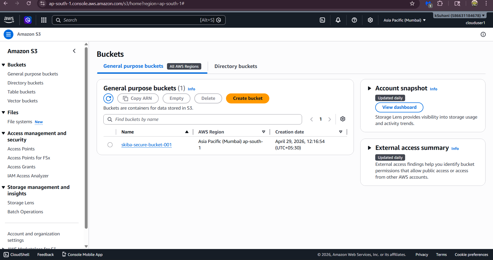
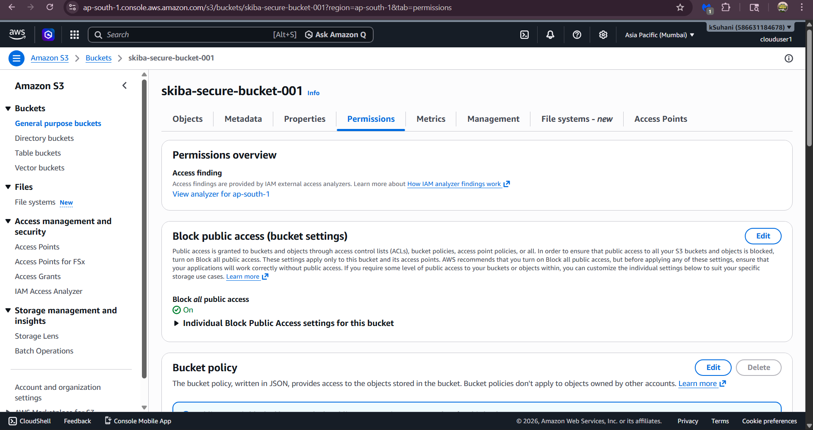
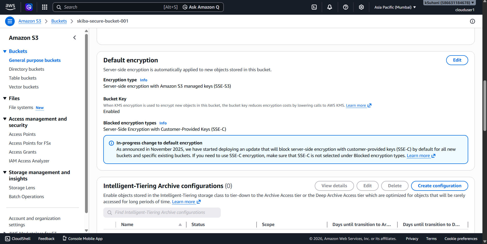
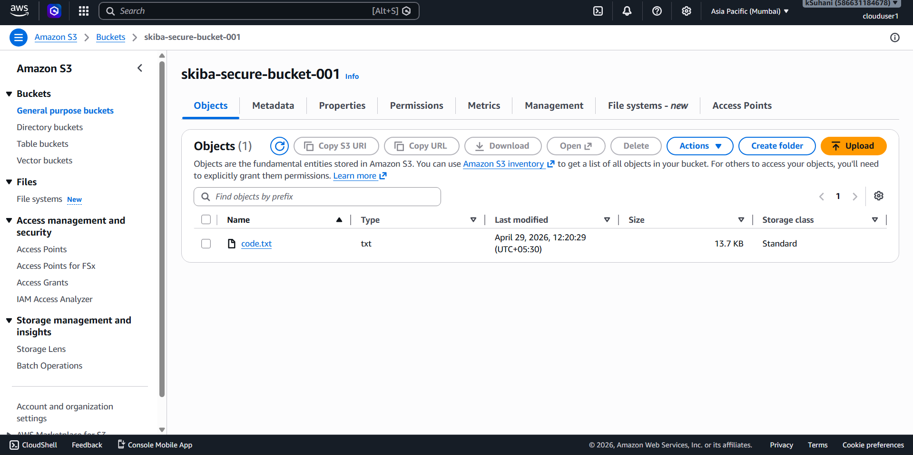

🔐 Secure Cloud Storage using AWS S3
A hands-on cloud security project demonstrating secure object storage on Amazon Web Services.

📌 What This Project Does
This project demonstrates how to create and configure a private, encrypted S3 bucket on AWS that follows security best practices — including blocking all public access and enabling server-side encryption to protect data at rest.

☁️ AWS Services Used

Amazon S3 — object storage service
SSE-S3 — Server-Side Encryption with Amazon S3 managed keys
Block Public Access — bucket-level security control
IAM — account access via AWS IAM user (clouduser1)

🛠️ Step-by-Step: What I Built
Step 1 — Created the S3 Bucket
Created a general purpose bucket named skiba-secure-bucket-001 in the Asia Pacific (Mumbai) ap-south-1 region on April 29, 2026.
Step 2 — Blocked All Public Access
Navigated to the Permissions tab and enabled Block all public access — set to ON. This ensures no object in the bucket can ever be accessed publicly by accident.
Step 3 — Enabled Server-Side Encryption
Configured default encryption using SSE-S3 (Server-Side Encryption with Amazon S3 managed keys). This means every file uploaded is automatically encrypted at rest — no manual steps needed per file.
Step 4 — Uploaded a File
Successfully uploaded code.txt (13.7 KB) to the bucket, stored under the Standard storage class. The file is encrypted and private by default.

## 📸 Screenshots

### Bucket created

### Block public access — enabled

### Server-side encryption — SSE-S3 enabled

### File uploaded successfully

💡 What I Learned

How Amazon S3 organizes storage into buckets and objects, and how regions affect data location
Why blocking public access is a critical first step in any real-world cloud storage setup — a misconfigured S3 bucket is one of the most common cloud security mistakes
How server-side encryption (SSE-S3) automatically protects data at rest without needing to manage encryption keys manually

🔗 Author
Suhani Kadam — Aspiring Cloud & Security Engineer
📧 kadamsuhani29@gmail.com
🐙 github.com/Suhani2929
